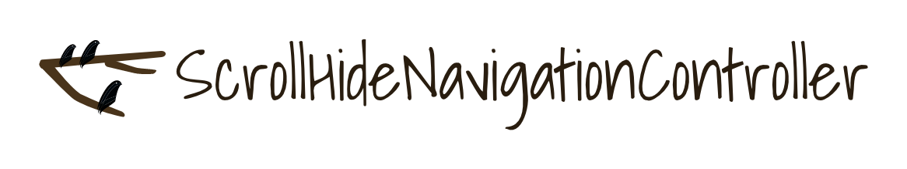

# ScrollHideNavigationController

<p align="center">
  
</p>


ScrollHideNavigationController is Objective-c version of [AMScrollingNavbar](https://github.com/andreamazz/AMScrollingNavbar)
this version is compatible with [PageMenu](https://github.com/PageMenu/PageMenu)
A custom UINavigationController that enables the scrolling of the navigation bar alongside the
scrolling of an observed content view.  


Sponsored by [IQBoxy app](https://itunes.apple.com/us/app/iqboxy-receipts/id804152735?ls=1&mt=8)
<p align="center">
  <a href='https://www.iqboxy.com/' alt='sponsored by IQBoxy app'>
    
  </a>
</p>

### Versioning notes

- Version `1.x` is written as a subclass of `UINavigationController`, in Objective C.  

# Screenshot

<p align="center">
  
</p>


## Usage

Download source classes and add them into your project 

Make sure to use a subclass of `ScrollHideNavigationController` for your `UINavigationController`. Either set the class of your `UINavigationController` in your storyboard, or create programmatically a `ScrollingNavigationController` instance in your code.


#### Objective-C

```objc

#import "ScrollHideNavigationController.h"

- (void)viewWillAppear:(BOOL)animated {
    [super viewWillAppear:animated];

    [(ScrollingNavigationController *)self.navigationController followScrollView:self.tableView];
}
```

you can put a delay 

```objc
- (void)viewWillAppear:(BOOL)animated {
    [super viewWillAppear:animated];

    [(ScrollingNavigationController *)self.navigationController followScrollView:self.tableView delay:50.0f];
}
```


stop follow view

```objc
 [((ScrollHideNavigationController *)self.navigationController) stopFollowingScrollView];
```


# Author
[Alejandro Uribe Sánchez](https://www.linkedin.com/in/alejandro-uribe-sanchez-15759b55/). 

# Contributors
[Andrea Mazzini](https://github.com/andreamazz)

## Similar Projects
+ [AMScrollingNavbar](https://github.com/andreamazz/AMScrollingNavbar)
+ [TLYShyNavBar](https://github.com/telly/TLYShyNavBar)
+ [BLKFlexibleHeightBar](https://github.com/bryankeller/BLKFlexibleHeightBar)
+ [AMScrollingNavbar](https://github.com/andreamazz/AMScrollingNavbar)
+ [GTScrollNavigationBar](https://github.com/luugiathuy/GTScrollNavigationBar)
+ [JKAutoShrinkView](https://github.com/fsjack/JKAutoShrinkView)
+ [SherginScrollableNavigationBar](https://github.com/shergin/SherginScrollableNavigationBar)

# MIT License
    The MIT License (MIT)

    Copyright (c) 2017 Alejandro Uribe Sánchez

    Permission is hereby granted, free of charge, to any person obtaining a copy of
    this software and associated documentation files (the "Software"), to deal in
    the Software without restriction, including without limitation the rights to
    use, copy, modify, merge, publish, distribute, sublicense, and/or sell copies of
    the Software, and to permit persons to whom the Software is furnished to do so,
    subject to the following conditions:

    The above copyright notice and this permission notice shall be included in all
    copies or substantial portions of the Software.

    THE SOFTWARE IS PROVIDED "AS IS", WITHOUT WARRANTY OF ANY KIND, EXPRESS OR
    IMPLIED, INCLUDING BUT NOT LIMITED TO THE WARRANTIES OF MERCHANTABILITY, FITNESS
    FOR A PARTICULAR PURPOSE AND NONINFRINGEMENT. IN NO EVENT SHALL THE AUTHORS OR
    COPYRIGHT HOLDERS BE LIABLE FOR ANY CLAIM, DAMAGES OR OTHER LIABILITY, WHETHER
    IN AN ACTION OF CONTRACT, TORT OR OTHERWISE, ARISING FROM, OUT OF OR IN
    CONNECTION WITH THE SOFTWARE OR THE USE OR OTHER DEALINGS IN THE SOFTWARE.
